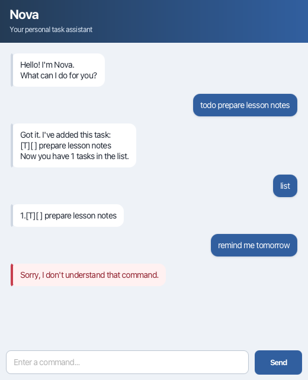

# Nova User Guide



Nova is a desktop task manager that helps you record todos, deadlines, and
events through a simple chat interface. Your tasks are saved automatically so
that they remain available the next time you open Nova.

## Quick start

1. Ensure that Java 25 is installed.
2. Download `nova.jar` from the latest release.
3. Open a terminal in the folder containing the JAR file.
4. Run `java -jar nova.jar`.
5. Type a command and press **Enter**, or click **Send**.

Nova displays normal replies on the left and highlights invalid commands in
red. Commands are case-sensitive and should be entered in lowercase.

## Commands

### Add a todo

Use `todo DESCRIPTION` to add a task without a date or time.

```text
todo prepare lesson notes
```

### Add a deadline

Use `deadline DESCRIPTION /by yyyy-MM-dd HHmm` to add a task with a deadline.
The date and time must use the shown 24-hour format.

```text
deadline submit report /by 2026-09-18 2100
```

### Add an event

Use `event DESCRIPTION /from START /to END` to add an event with a start and
end description.

```text
event consultation /from 2pm /to 4pm
```

### List tasks

Use `list` to display all saved tasks and their numbers.

```text
list
```

`[ ]` identifies an incomplete task, while `[X]` identifies a completed task.

### Mark a task

Use `mark NUMBER` to mark the specified task as completed. Task numbers are
shown by the `list` command.

```text
mark 1
```

### Delete a task

Use `delete NUMBER` to permanently remove the specified task.

```text
delete 2
```

### Update a task

Use `update NUMBER DESCRIPTION` to replace a task's description. Its type,
completion status, date, and time details remain unchanged.

```text
update 1 prepare mathematics lesson notes
```

### Find tasks

Use `find KEYWORD` to display tasks whose descriptions contain the exact,
case-sensitive keyword.

```text
find lesson
```

### Exit Nova

Use `bye` to display Nova's farewell message. You can then close the window.

```text
bye
```

## Data storage

Nova stores tasks in `data/nova.txt`, relative to the folder from which the
application is launched. Do not edit this file while Nova is running.
